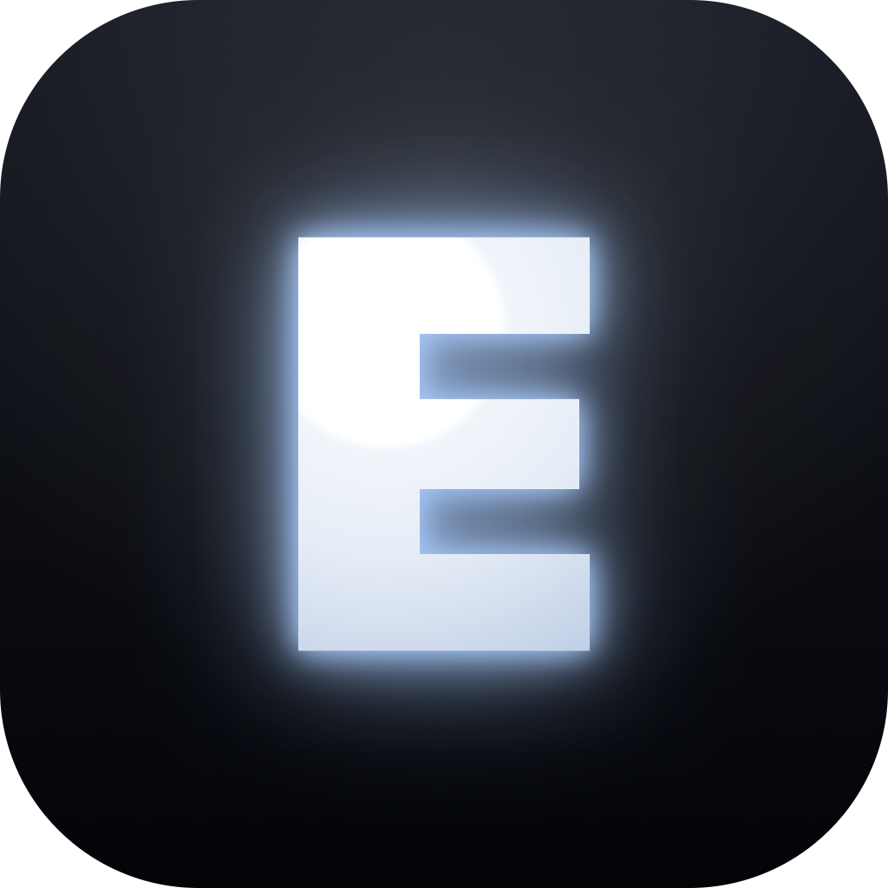

<p align="center">
  
</p>

<h1 align="center">Engram</h1>

<p align="center">
  <b>One shared memory for all your AIs.</b><br>
  Your assistants forget you the moment a chat ends — and each one lives in its own silo.
  Engram is the memory they share.
</p>

<p align="center">
  
  
  
  
</p>

## What it is

Pull your context in from any AI — a ChatGPT or Claude export, any Markdown / text / JSON, or a quick
paste — into one private, **local** memory. Then any assistant that speaks **MCP** (Claude Desktop,
Claude Code, your own apps) can `recall` it, across every conversation you've fed in. Remember once;
every connected AI knows it.

You own all of it: memories are plain **Markdown files on your Mac** (`memories/<conversation>.md`) —
readable, greppable, editable, deletable. **Nothing is ever uploaded.**

## How it works

- **One memory, many minds.** A single store every MCP client reads from and writes to. "Collective
  mind" recall (`.all`) searches across all your conversations at once; or scope recall to a single
  conversation, or to one named file you've grouped.
- **Bring your history in.** Import a ChatGPT / Claude export, Markdown/text/JSON, or paste — and
  choose **Key facts** (keep only the durable things *you* said) or **Everything**. Auto-capture from
  Claude Code transcripts is built in (opt-in).
- **Semantic recall, on device.** Embeddings run locally via Apple's Natural Language framework (an
  optional one-time download upgrades to the contextual transformer). No model server, no network for
  recall.
- **Native, and yours.** A real **native macOS app** (SwiftUI + AppKit — no Electron, no web
  wrapper). Local-first by design: no account, no telemetry, no analytics. The only network is
  **opt-in** and never sends your data — a manual "Check for Updates", an optional local-Ollama
  distiller, and the one-time on-device model download. See [PRIVACY.md](PRIVACY.md).

## Install

**Homebrew** — the MCP server + capture CLI, the fastest path:

```sh
brew install albertofettucini/engram/engram
engram-mcp --connect                 # register Engram with Claude Desktop, then restart it
engram-mcp --prepare-embeddings      # optional: one-time on-device model for better recall
engram-capture --watch               # optional: auto-capture durable facts from Claude Code
```

**The desktop app** — to browse, edit, and import your memories: grab `Engram-<version>.zip` from the
[latest release](https://github.com/albertofettucini/Engram/releases/latest), unzip, drag it to
Applications, then **right-click → Open** the first time. The app is unsigned (no paid Apple cert), so
Gatekeeper asks once; after that it opens normally.

**Connect any MCP client.** Anything that speaks MCP reads and writes the same store. `--connect` writes
the Claude Desktop config for you; to wire another client by hand, point it at the `engram-mcp` binary
(`which engram-mcp` — usually `/opt/homebrew/bin` on Apple Silicon, `/usr/local/bin` on Intel):

```json
{
  "mcpServers": {
    "engram": { "command": "/opt/homebrew/bin/engram-mcp" }
  }
}
```

**Build from source** — no Homebrew needed:

```sh
git clone https://github.com/albertofettucini/Engram && cd Engram
swift build -c release
.build/release/engram-mcp --connect
bash packaging/make-app.sh           # → Engram.app on your Desktop
```

Requirements: the **app needs macOS 14+**; the **CLI tools (MCP server, capture) run on macOS 13+**.
No backend, no third-party services — the engine, MCP server, and capture tool are pure Swift + Foundation.

## Engine API

```swift
let engine = try MemoryEngine(root: memoriesFolderURL)
try engine.remember("I prefer dark mode.", source: "manual", conversation: "chat-1")
let hits = engine.recall("what theme do I like", scope: .all)   // collective mind
let where_ = engine.search("dark mode")                         // keyword → which conversation
try engine.forget(hits[0].memory.id)                            // soft delete (stays on disk)
```

## Build & test

```sh
swift build
swift test
```

## License

[MIT](LICENSE) © 2026 Joseph.

<p align="center"><sub>Your AIs forget. Engram remembers — and shares it.</sub></p>
